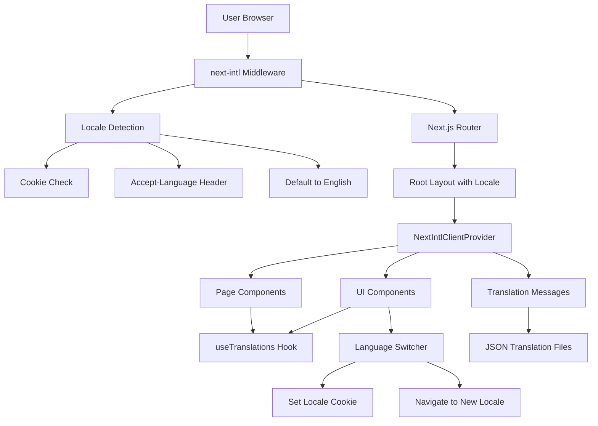

# Design Document: Multi-Language Support (i18n)

## Overview

This design implements internationalization (i18n) for a Next.js application using the [next-intl library](https://next-intl-docs.vercel.app/). The system provides multi-language support for seven languages through locale-prefixed routing, automatic language detection, persistent user preferences, and a comprehensive translation management system.

The architecture leverages Next.js App Router features with next-intl's middleware for locale negotiation, server-side translation loading, and client-side language switching. Translation files are organized as JSON dictionaries with hierarchical structure matching the application's component organization.

## Architecture

### High-Level Architecture



### Routing Structure

The application uses locale-prefixed routing where each URL includes the language code:

```
/en/services          → English services page
/da/services          → Danish services page
/de/privacy           → German privacy page
/uk/guidance          → Ukrainian guidance page
```

The middleware intercepts all requests, determines the appropriate locale, and ensures the URL contains the correct locale prefix.

### Translation Loading Strategy

Translations are loaded server-side per locale to minimize client bundle size:

1. Middleware determines the active locale
2. Root layout loads only the required translation file for that locale
3. Translation messages are passed to client components via NextIntlClientProvider
4. Client components access translations through the useTranslations hook

## Components and Interfaces

### 1. Routing Configuration (i18n/routing.ts)

Defines supported locales and routing behavior:

```typescript
import { defineRouting } from 'next-intl/routing';

export const routing = defineRouting({
  // Supported locales
  locales: ['en', 'da', 'de', 'uk', 'pl', 'ro', 'ru'],
  
  // Default locale (fallback)
  defaultLocale: 'en',
  
  // Locale prefix strategy: always include locale in URL
  localePrefix: 'always'
});
```

### 2. Middleware (middleware.ts)

Handles locale negotiation and routing:

```typescript
import createMiddleware from 'next-intl/middleware';
import { routing } from './i18n/routing';

export default createMiddleware(routing);

export const config = {
  // Match all pathnames except:
  // - API routes (/api/*)
  // - Static files (/_next/*, files with dots)
  // - Vercel internals (/_vercel/*)
  matcher: ['/((?!api|_next|_vercel|.*\\..*).*)']
};
```

The middleware performs these operations:
- Detects user's preferred locale from cookie, Accept-Language header, or defaults to English
- Redirects requests without locale prefix to the appropriate locale-prefixed URL
- Sets a cookie to persist the user's language preference
- Provides alternate links for SEO

### 3. Request Configuration (i18n/request.ts)

Configures how translations are loaded for each request:

```typescript
import { getRequestConfig } from 'next-intl/server';
import { routing } from './routing';

export default getRequestConfig(async ({ requestLocale }) => {
  // Validate that the incoming locale parameter is valid
  let locale = await requestLocale;
  
  if (!locale || !routing.locales.includes(locale as any)) {
    locale = routing.defaultLocale;
  }

  return {
    locale,
    messages: (await import(`../messages/${locale}.json`)).default
  };
});
```

### 4. Root Layout (app/[locale]/layout.tsx)

Wraps the application with translation provider:

```typescript
import { NextIntlClientProvider } from 'next-intl';
import { getMessages } from 'next-intl/server';
import { notFound } from 'next/navigation';
import { routing } from '@/i18n/routing';

export function generateStaticParams() {
  return routing.locales.map((locale) => ({ locale }));
}

export default async function LocaleLayout({
  children,
  params: { locale }
}: {
  children: React.ReactNode;
  params: { locale: string };
}) {
  // Validate locale
  if (!routing.locales.includes(locale as any)) {
    notFound();
  }

  // Load messages for the locale
  const messages = await getMessages();

  return (
    <html lang={locale}>
      <body>
        <NextIntlClientProvider messages={messages}>
          {children}
        </NextIntlClientProvider>
      </body>
    </html>
  );
}
```

### 5. Language Switcher Component

Provides UI for users to change language:

```typescript
'use client';

import { useLocale } from 'next-intl';
import { useRouter, usePathname } from 'next/navigation';
import { useTransition } from 'react';

const languages = [
  { code: 'en', name: 'English' },
  { code: 'da', name: 'Dansk' },
  { code: 'de', name: 'Deutsch' },
  { code: 'uk', name: 'Українська' },
  { code: 'pl', name: 'Polski' },
  { code: 'ro', name: 'Română' },
  { code: 'ru', name: 'Русский' }
];

export function LanguageSwitcher() {
  const locale = useLocale();
  const router = useRouter();
  const pathname = usePathname();
  const [isPending, startTransition] = useTransition();

  function onSelectChange(newLocale: string) {
    startTransition(() => {
      // Remove current locale from pathname
      const pathWithoutLocale = pathname.replace(`/${locale}`, '');
      // Navigate to new locale
      router.replace(`/${newLocale}${pathWithoutLocale}`);
    });
  }

  return (
    <select
      value={locale}
      onChange={(e) => onSelectChange(e.target.value)}
      disabled={isPending}
      className="language-selector"
    >
      {languages.map((lang) => (
        <option key={lang.code} value={lang.code}>
          {lang.name}
        </option>
      ))}
    </select>
  );
}
```

### 6. Translation Hook Usage

Components access translations using the useTranslations hook:

```typescript
'use client';

import { useTranslations } from 'next-intl';

export function Hero() {
  const t = useTranslations('HomePage.Hero');

  return (
    <section>
      <h1>{t('title')}</h1>
      <p>{t('description')}</p>
      <button>{t('cta')}</button>
    </section>
  );
}
```

For server components:

```typescript
import { getTranslations } from 'next-intl/server';

export async function HeroServer() {
  const t = await getTranslations('HomePage.Hero');

  return (
    <section>
      <h1>{t('title')}</h1>
      <p>{t('description')}</p>
    </section>
  );
}
```

### 7. Navigation Utilities (i18n/navigation.ts)

Type-safe navigation helpers that preserve locale:

```typescript
import { createNavigation } from 'next-intl/navigation';
import { routing } from './routing';

export const { Link, redirect, usePathname, useRouter } = 
  createNavigation(routing);
```

Usage in components:

```typescript
import { Link } from '@/i18n/navigation';

export function Navigation() {
  return (
    <nav>
      <Link href="/services">Services</Link>
      <Link href="/guidance">Guidance</Link>
    </nav>
  );
}
```

## Data Models

### Translation File Structure

Translation files are organized hierarchically in JSON format:

**File Location:** `messages/{locale}.json`

**Structure:**

```json
{
  "Common": {
    "nav": {
      "home": "Home",
      "services": "Services",
      "guidance": "Guidance",
      "knowledge": "Knowledge"
    },
    "footer": {
      "privacy": "Privacy Policy",
      "terms": "Terms of Service",
      "copyright": "© 2024 All rights reserved"
    },
    "auth": {
      "signIn": "Sign In",
      "signUp": "Sign Up",
      "signOut": "Sign Out",
      "email": "Email",
      "password": "Password"
    }
  },
  "HomePage": {
    "Hero": {
      "title": "Welcome to Our Platform",
      "description": "Build amazing things with our tools",
      "cta": "Get Started"
    },
    "Features": {
      "title": "Features",
      "feature1": {
        "title": "Fast",
        "description": "Lightning fast performance"
      }
    }
  },
  "ServicesPage": {
    "Hero": {
      "title": "Our Services",
      "description": "Comprehensive solutions for your needs"
    },
    "Grid": {
      "service1": {
        "title": "Consulting",
        "description": "Expert guidance for your project"
      }
    }
  },
  "GuidancePage": {
    "Hero": {
      "title": "Guidance",
      "subtitle": "Step-by-step help"
    },
    "Steps": {
      "step1": {
        "title": "Getting Started",
        "description": "Begin your journey"
      }
    }
  },
  "KnowledgePage": {
    "Hero": {
      "title": "Knowledge Base",
      "searchPlaceholder": "Search articles..."
    },
    "Categories": {
      "category1": {
        "title": "Getting Started",
        "articleCount": "{count} articles"
      }
    }
  },
  "PrivacyPage": {
    "title": "Privacy Policy",
    "lastUpdated": "Last updated: {date}",
    "sections": {
      "dataCollection": {
        "title": "Data Collection",
        "content": "We collect the following information..."
      }
    }
  },
  "TermsPage": {
    "title": "Terms of Service",
    "lastUpdated": "Last updated: {date}",
    "sections": {
      "acceptance": {
        "title": "Acceptance of Terms",
        "content": "By using our service..."
      }
    }
  },
  "ChatInterface": {
    "placeholder": "Type your message...",
    "send": "Send",
    "thinking": "Thinking...",
    "error": "An error occurred. Please try again."
  },
  "AuthModal": {
    "title": "Sign In",
    "emailLabel": "Email Address",
    "passwordLabel": "Password",
    "submitButton": "Continue",
    "switchToSignUp": "Don't have an account? Sign up",
    "switchToSignIn": "Already have an account? Sign in",
    "errors": {
      "invalidEmail": "Please enter a valid email",
      "passwordTooShort": "Password must be at least 8 characters",
      "authFailed": "Authentication failed. Please try again."
    }
  }
}
```

### Locale Configuration Model

```typescript
type Locale = 'en' | 'da' | 'de' | 'uk' | 'pl' | 'ro' | 'ru';

interface LocaleConfig {
  code: Locale;
  name: string;
  nativeName: string;
  direction: 'ltr' | 'rtl';
}

const localeConfigs: LocaleConfig[] = [
  { code: 'en', name: 'English', nativeName: 'English', direction: 'ltr' },
  { code: 'da', name: 'Danish', nativeName: 'Dansk', direction: 'ltr' },
  { code: 'de', name: 'German', nativeName: 'Deutsch', direction: 'ltr' },
  { code: 'uk', name: 'Ukrainian', nativeName: 'Українська', direction: 'ltr' },
  { code: 'pl', name: 'Polish', nativeName: 'Polski', direction: 'ltr' },
  { code: 'ro', name: 'Romanian', nativeName: 'Română', direction: 'ltr' },
  { code: 'ru', name: 'Russian', nativeName: 'Русский', direction: 'ltr' }
];
```

### Translation Message Types

For TypeScript type safety, define message types:

```typescript
// messages/types.ts
export interface Messages {
  Common: {
    nav: {
      home: string;
      services: string;
      guidance: string;
      knowledge: string;
    };
    footer: {
      privacy: string;
      terms: string;
      copyright: string;
    };
    auth: {
      signIn: string;
      signUp: string;
      signOut: string;
      email: string;
      password: string;
    };
  };
  HomePage: {
    Hero: {
      title: string;
      description: string;
      cta: string;
    };
    Features: {
      title: string;
      feature1: {
        title: string;
        description: string;
      };
    };
  };
  // ... other page sections
}

declare global {
  interface IntlMessages extends Messages {}
}
```

## Correctness Properties

*A property is a characteristic or behavior that should hold true across all valid executions of a system—essentially, a formal statement about what the system should do. Properties serve as the bridge between human-readable specifications and machine-verifiable correctness guarantees.*


### Property 1: Locale Detection and Fallback

*For any* HTTP request with an Accept-Language header, the middleware should detect and use a supported locale from the header if available, otherwise default to English.

**Validates: Requirements 1.2, 1.3, 1.4**

### Property 2: Translation File Existence

*For any* supported locale, a corresponding JSON translation file should exist and be loadable without errors.

**Validates: Requirements 1.5, 4.1**

### Property 3: Language Switcher Updates Content

*For any* language selection in the language switcher, all visible content should immediately update to display translations from the selected locale.

**Validates: Requirements 2.2**

### Property 4: Language Preference Persistence Round-Trip

*For any* locale selection, after setting the preference and simulating a new session, the system should restore and use the previously selected locale.

**Validates: Requirements 2.3, 2.4**

### Property 5: Language Switcher Reflects Active Locale

*For any* active locale, the language switcher component should indicate that locale as currently selected.

**Validates: Requirements 2.5**

### Property 6: Translation Completeness

*For any* page or component that requires translation, all translation keys used in that page/component should exist in all seven locale translation files.

**Validates: Requirements 3.1, 3.2, 3.3, 3.4, 3.5, 3.6, 3.7, 3.8, 3.9, 3.10, 3.11**

### Property 7: Translation Key Lookup

*For any* valid translation key and supported locale, requesting that translation should return a non-empty string value.

**Validates: Requirements 4.2**

### Property 8: Translation Fallback to English

*For any* translation key that exists in English but is missing in another locale, requesting that key in the other locale should return the English translation.

**Validates: Requirements 4.3**

### Property 9: Missing Key Returns Key Itself

*For any* translation key that doesn't exist in any locale file, requesting that key should return the key string itself as a visible indicator.

**Validates: Requirements 4.4**

### Property 10: Dynamic Content Translation

*For any* dynamic message (error, success, or UI label) and any supported locale, the message should be rendered in that locale's language.

**Validates: Requirements 5.1, 5.2, 5.3**

### Property 11: Variable Interpolation

*For any* translation string containing variable placeholders (e.g., "{name}", "{count}") and any set of variable values, the system should correctly substitute the variables into the translated string.

**Validates: Requirements 5.4**

### Property 12: Pluralization Support

*For any* numeric count and translation key with pluralization rules, the system should return the grammatically correct plural form for the active locale's language rules.

**Validates: Requirements 5.5**

### Property 13: URL Contains Locale Prefix

*For any* page route and active locale, the URL pathname should begin with the locale code (e.g., "/en/", "/da/").

**Validates: Requirements 6.1, 6.3**

### Property 14: Unprefixed URL Redirects

*For any* request to a URL without a locale prefix, the middleware should redirect to the same path with an appropriate locale prefix added.

**Validates: Requirements 6.2**

### Property 15: Locale Switch Preserves Path

*For any* current page path and locale switch, the new URL should maintain the same page path with only the locale prefix changed.

**Validates: Requirements 6.4**

### Property 16: Locale Switch Preserves Query and Hash

*For any* URL with query parameters and/or hash fragments, switching locales should preserve those query parameters and hash fragments in the new URL.

**Validates: Requirements 6.5**

### Property 17: RTL Direction Application

*For any* locale configured with RTL text direction, the HTML document root should have the dir="rtl" attribute applied.

**Validates: Requirements 7.3**

### Property 18: Only Active Locale Loaded Initially

*For any* initial page load, only the translation file for the detected/active locale should be included in the initial JavaScript bundle.

**Validates: Requirements 8.1**

### Property 19: Lazy Loading on Language Switch

*For any* language switch to a locale whose translations are not yet cached, the system should asynchronously fetch that locale's translation file.

**Validates: Requirements 8.2**

### Property 20: Translation File Caching

*For any* locale whose translation file has been loaded once, subsequent requests for that locale's translations should not trigger additional network requests.

**Validates: Requirements 8.3**

### Property 21: Translation Load Failure Fallback

*For any* translation file that fails to load or is missing, the system should gracefully fall back to English translations without crashing.

**Validates: Requirements 8.5**

## Error Handling

### Missing Translation Keys

When a translation key is requested but doesn't exist:

1. **Fallback Chain:**
   - First, check the active locale's translation file
   - If missing, check the English (default) translation file
   - If still missing, return the key itself as a string

2. **Development vs Production:**
   - Development: Log warnings to console when keys are missing
   - Production: Silently fall back without console noise

3. **Example:**
   ```typescript
   // Key exists in English but not in Danish
   // Active locale: 'da'
   t('HomePage.newFeature') // Returns English translation
   
   // Key doesn't exist anywhere
   t('NonExistent.key') // Returns 'NonExistent.key'
   ```

### Translation File Load Failures

When a translation file fails to load:

1. **Network Errors:**
   - Catch fetch errors during translation file loading
   - Fall back to English translations
   - Log error for monitoring

2. **Malformed JSON:**
   - Catch JSON parse errors
   - Fall back to English translations
   - Log error with file details

3. **Example Error Handler:**
   ```typescript
   async function loadMessages(locale: string) {
     try {
       return await import(`../messages/${locale}.json`);
     } catch (error) {
       console.error(`Failed to load translations for ${locale}:`, error);
       // Fall back to English
       return await import(`../messages/en.json`);
     }
   }
   ```

### Invalid Locale Handling

When an invalid or unsupported locale is requested:

1. **URL with Invalid Locale:**
   - Middleware detects invalid locale in URL
   - Redirects to the same path with default locale (English)
   - Example: `/invalid/services` → `/en/services`

2. **Programmatic Locale Change:**
   - Validate locale before applying
   - If invalid, ignore the change and keep current locale
   - Log warning in development

3. **Example:**
   ```typescript
   function changeLocale(newLocale: string) {
     if (!routing.locales.includes(newLocale)) {
       console.warn(`Invalid locale: ${newLocale}`);
       return; // Keep current locale
     }
     // Proceed with locale change
   }
   ```

### Cookie/Storage Errors

When reading or writing language preferences fails:

1. **Cookie Read Failure:**
   - If cookie is corrupted or unreadable, ignore it
   - Fall back to Accept-Language header detection
   - Continue with normal locale detection flow

2. **Cookie Write Failure:**
   - If setting cookie fails (e.g., privacy settings), continue without error
   - User preference won't persist, but app still functions
   - Log warning for debugging

### Interpolation Errors

When variable interpolation fails:

1. **Missing Variables:**
   - If a translation expects variables but none provided, show placeholder
   - Example: `"Hello {name}"` with no name → `"Hello {name}"`

2. **Type Mismatches:**
   - If variable type doesn't match expected (e.g., string instead of number), convert gracefully
   - Log warning in development

3. **Example:**
   ```typescript
   // Translation: "You have {count} messages"
   t('messages.count') // Missing count variable
   // Returns: "You have {count} messages"
   
   t('messages.count', { count: 5 }) // Correct usage
   // Returns: "You have 5 messages"
   ```

## Testing Strategy

### Dual Testing Approach

The testing strategy employs both unit tests and property-based tests to ensure comprehensive coverage:

- **Unit Tests:** Verify specific examples, edge cases, and error conditions
- **Property Tests:** Verify universal properties across all inputs using randomized testing

### Property-Based Testing Configuration

**Library:** [fast-check](https://github.com/dubzzz/fast-check) for TypeScript/JavaScript property-based testing

**Configuration:**
- Minimum 100 iterations per property test
- Each property test references its design document property
- Tag format: `Feature: i18n-multi-language-support, Property {number}: {property_text}`

**Example Property Test:**

```typescript
import fc from 'fast-check';
import { describe, it, expect } from 'vitest';

describe('i18n Property Tests', () => {
  // Feature: i18n-multi-language-support, Property 2: Translation File Existence
  it('should have translation files for all supported locales', () => {
    fc.assert(
      fc.property(
        fc.constantFrom('en', 'da', 'de', 'uk', 'pl', 'ro', 'ru'),
        async (locale) => {
          const messages = await import(`@/messages/${locale}.json`);
          expect(messages).toBeDefined();
          expect(typeof messages).toBe('object');
        }
      ),
      { numRuns: 100 }
    );
  });

  // Feature: i18n-multi-language-support, Property 7: Translation Key Lookup
  it('should return non-empty string for valid translation keys', () => {
    fc.assert(
      fc.property(
        fc.constantFrom('en', 'da', 'de', 'uk', 'pl', 'ro', 'ru'),
        fc.constantFrom(
          'Common.nav.home',
          'HomePage.Hero.title',
          'AuthModal.title'
        ),
        async (locale, key) => {
          const t = await getTranslations({ locale });
          const result = t(key);
          expect(result).toBeTruthy();
          expect(typeof result).toBe('string');
          expect(result.length).toBeGreaterThan(0);
        }
      ),
      { numRuns: 100 }
    );
  });
});
```

### Unit Testing Focus Areas

**1. Middleware Behavior:**
- Test locale detection from Accept-Language header
- Test redirect behavior for unprefixed URLs
- Test cookie setting and reading
- Test invalid locale handling

**2. Language Switcher Component:**
- Test rendering of all seven language options
- Test locale change on selection
- Test disabled state during transition
- Test active locale indication

**3. Translation Hook:**
- Test basic translation retrieval
- Test nested key access
- Test variable interpolation
- Test pluralization
- Test missing key fallback

**4. Navigation Utilities:**
- Test Link component preserves locale
- Test router.push preserves locale
- Test pathname extraction

**5. Error Conditions:**
- Test missing translation file handling
- Test malformed JSON handling
- Test missing translation key behavior
- Test invalid locale rejection

**Example Unit Tests:**

```typescript
import { describe, it, expect, vi } from 'vitest';
import { render, screen } from '@testing-library/react';
import { LanguageSwitcher } from '@/components/LanguageSwitcher';

describe('LanguageSwitcher', () => {
  it('should display all seven supported languages', () => {
    render(<LanguageSwitcher />);
    
    expect(screen.getByText('English')).toBeInTheDocument();
    expect(screen.getByText('Dansk')).toBeInTheDocument();
    expect(screen.getByText('Deutsch')).toBeInTheDocument();
    expect(screen.getByText('Українська')).toBeInTheDocument();
    expect(screen.getByText('Polski')).toBeInTheDocument();
    expect(screen.getByText('Română')).toBeInTheDocument();
    expect(screen.getByText('Русский')).toBeInTheDocument();
  });

  it('should indicate the currently active locale', () => {
    vi.mock('next-intl', () => ({
      useLocale: () => 'da'
    }));
    
    render(<LanguageSwitcher />);
    const select = screen.getByRole('combobox');
    expect(select).toHaveValue('da');
  });
});

describe('Translation Fallback', () => {
  it('should return English translation when key missing in active locale', async () => {
    const messages = {
      en: { test: 'English text' },
      da: {} // Missing 'test' key
    };
    
    const t = createTranslator('da', messages);
    expect(t('test')).toBe('English text');
  });

  it('should return key itself when missing in all locales', async () => {
    const messages = {
      en: {},
      da: {}
    };
    
    const t = createTranslator('da', messages);
    expect(t('missing.key')).toBe('missing.key');
  });
});
```

### Integration Testing

**1. Full Locale Switch Flow:**
- User visits site → locale detected → content rendered
- User switches language → URL updates → content updates → cookie set
- User returns → cookie read → previous locale restored

**2. Navigation with Locale:**
- Navigate between pages → locale preserved in URL
- External link → locale detection → redirect to prefixed URL

**3. Translation Loading:**
- Initial load → only active locale loaded
- Switch language → new locale loaded asynchronously
- Switch back → cached locale used (no network request)

### Performance Testing

While not part of property-based testing, these performance characteristics should be validated:

1. **Bundle Size:** Verify only one locale's translations in initial bundle
2. **Load Time:** Measure translation file load time (should be < 100ms)
3. **Switch Time:** Measure language switch time (should be < 200ms)
4. **Memory Usage:** Verify translation caching doesn't cause memory leaks

### Test Coverage Goals

- **Unit Test Coverage:** Minimum 80% code coverage
- **Property Test Coverage:** All 21 correctness properties implemented
- **Integration Test Coverage:** All critical user flows tested
- **Edge Case Coverage:** All error conditions tested

### Continuous Testing

- Run unit tests on every commit
- Run property tests on every pull request
- Run integration tests before deployment
- Monitor translation completeness in CI/CD pipeline
