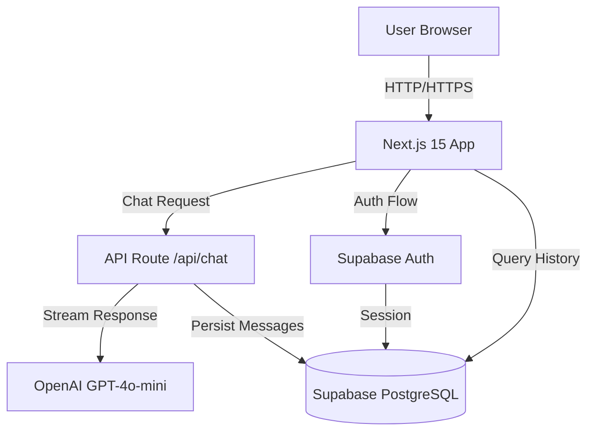

# Design Document: LocalDesk Landing Page

## Overview

LocalDesk is a Next.js 15 application that provides an AI-powered chat interface for Danish expats seeking help with bureaucracy. The system architecture follows a modern serverless approach with Vercel deployment, Supabase backend, and OpenAI integration via the Vercel AI SDK.

The design emphasizes immediate accessibility (guest mode), future scalability (authentication and data persistence), and a clean Nordic aesthetic. The application uses the App Router pattern in Next.js 15, TypeScript for type safety, and Tailwind CSS with Shadcn/UI for consistent, accessible components.

## Architecture

### High-Level Architecture



### Technology Stack

- **Frontend Framework**: Next.js 15 with App Router
- **Language**: TypeScript (strict mode)
- **Styling**: Tailwind CSS + Shadcn/UI components
- **AI Integration**: Vercel AI SDK with OpenAI GPT-4o-mini
- **Backend**: Supabase (PostgreSQL + Auth)
- **Deployment**: Vercel
- **Icons**: lucide-react

### Deployment Architecture

- **Hosting**: Vercel serverless functions
- **Database**: Supabase managed PostgreSQL
- **CDN**: Vercel Edge Network
- **Environment**: Production and Preview environments

## Components and Interfaces

### Component Hierarchy

```
app/
├── layout.tsx (Root Layout)
├── page.tsx (Landing Page)
├── api/
│   └── chat/
│       └── route.ts (Chat API Route)
└── components/
    ├── Header.tsx
    ├── Hero.tsx
    ├── Features.tsx
    ├── Footer.tsx
    ├── ChatInterface.tsx
    ├── ChatMessage.tsx
    ├── SuggestedQuestions.tsx
    └── ui/ (Shadcn components)
```

### Core Components

#### 1. Header Component

**Purpose**: Navigation bar with branding and authentication

**Interface**:
```typescript
interface HeaderProps {
  user: User | null;
}

function Header({ user }: HeaderProps): JSX.Element
```

**Behavior**:
- Displays LocalDesk logo (left-aligned)
- Shows "Log In" button when user is null
- Shows user avatar/email when authenticated
- Uses Danish Red for login button accent

#### 2. Hero Component

**Purpose**: Primary value proposition section

**Interface**:
```typescript
function Hero(): JSX.Element
```

**Content**:
- Headline: "Navigate Danish Bureaucracy with Confidence"
- Subheadline: "Get instant answers about SKAT, visas, and housing from your AI-powered Danish consultant"
- Call-to-action: "Start Chatting" button (scrolls to chat)

#### 3. Features Component

**Purpose**: Display key benefits in a grid layout

**Interface**:
```typescript
interface Feature {
  icon: LucideIcon;
  title: string;
  description: string;
}

function Features(): JSX.Element
```

**Features List**:
1. Instant Answers (MessageSquare icon)
2. Expert Knowledge (GraduationCap icon)
3. No Login Required (Zap icon)
4. Always Available (Clock icon)

#### 4. ChatInterface Component

**Purpose**: Main chat interaction component

**Interface**:
```typescript
interface ChatInterfaceProps {
  userId?: string | null;
}

interface Message {
  id: string;
  role: 'user' | 'assistant';
  content: string;
  timestamp: Date;
}

function ChatInterface({ userId }: ChatInterfaceProps): JSX.Element
```

**State Management**:
```typescript
const [messages, setMessages] = useState<Message[]>([]);
const [input, setInput] = useState<string>('');
const [isLoading, setIsLoading] = useState<boolean>(false);
```

**Behavior**:
- Displays message history in scrollable container
- Shows SuggestedQuestions when messages array is empty
- Handles message submission via form
- Streams responses from /api/chat endpoint
- Auto-scrolls to latest message
- Persists messages if userId is provided

#### 5. ChatMessage Component

**Purpose**: Render individual chat messages

**Interface**:
```typescript
interface ChatMessageProps {
  role: 'user' | 'assistant';
  content: string;
  timestamp: Date;
}

function ChatMessage({ role, content, timestamp }: ChatMessageProps): JSX.Element
```

**Styling**:
- User messages: right-aligned, Danish Red background
- Assistant messages: left-aligned, slate-100 background
- Markdown rendering for assistant responses
- Timestamp display in small gray text

#### 6. SuggestedQuestions Component

**Purpose**: Display clickable question prompts

**Interface**:
```typescript
interface SuggestedQuestionsProps {
  onQuestionClick: (question: string) => void;
}

const SUGGESTED_QUESTIONS = [
  "How do I register with SKAT as a new resident?",
  "What documents do I need for a work visa?",
  "How can I find housing in Copenhagen?"
];

function SuggestedQuestions({ onQuestionClick }: SuggestedQuestionsProps): JSX.Element
```

**Behavior**:
- Renders 3 buttons with suggested questions
- Calls onQuestionClick when a button is clicked
- Uses subtle hover effects with Danish Red accent

#### 7. Footer Component

**Purpose**: Legal links and branding

**Interface**:
```typescript
function Footer(): JSX.Element
```

**Content**:
- Copyright notice
- Links: Privacy Policy, Terms of Service, Contact
- Minimal styling with slate-600 text

### API Routes

#### Chat API Route

**Endpoint**: `POST /api/chat`

**Request Body**:
```typescript
interface ChatRequest {
  messages: Array<{
    role: 'user' | 'assistant';
    content: string;
  }>;
  userId?: string;
}
```

**Response**: Streaming text response (Server-Sent Events)

**Implementation**:
```typescript
import { OpenAIStream, StreamingTextResponse } from 'ai';
import { Configuration, OpenAIApi } from 'openai-edge';

export async function POST(req: Request) {
  const { messages, userId } = await req.json();
  
  // Inject knowledge base into system prompt
  const systemPrompt = buildSystemPrompt();
  
  // Call OpenAI with streaming
  const response = await openai.createChatCompletion({
    model: 'gpt-4o-mini',
    stream: true,
    messages: [
      { role: 'system', content: systemPrompt },
      ...messages
    ],
  });
  
  const stream = OpenAIStream(response, {
    onCompletion: async (completion) => {
      // Persist to database if userId provided
      if (userId) {
        await saveMessage(userId, messages, completion);
      }
    }
  });
  
  return new StreamingTextResponse(stream);
}
```

**Knowledge Base System Prompt**:
```typescript
function buildSystemPrompt(): string {
  return `You are an expert Danish consultant specializing in helping expats navigate Danish bureaucracy.

Your expertise covers:
- SKAT (Danish Tax Authority): Registration, tax cards, annual returns
- Visas and Permits: Work permits, residence permits, documentation
- Housing: Rental market, contracts, tenant rights, finding apartments

Guidelines:
1. Provide accurate, actionable information about Danish procedures
2. Be warm and supportive - moving to a new country is challenging
3. If you don't know something, admit it and suggest official resources
4. Stay focused on Denmark-related topics
5. If asked about unrelated topics, politely redirect to Danish bureaucracy matters

Tone: Professional yet friendly, like a knowledgeable local helping a newcomer.`;
}
```

## Data Models

### Database Schema

#### Users Table

```sql
CREATE TABLE users (
  id UUID PRIMARY KEY DEFAULT gen_random_uuid(),
  email TEXT UNIQUE NOT NULL,
  created_at TIMESTAMPTZ DEFAULT NOW(),
  updated_at TIMESTAMPTZ DEFAULT NOW()
);
```

**Managed by Supabase Auth** - this table is automatically created and maintained.

#### Profiles Table

```sql
CREATE TABLE profiles (
  id UUID PRIMARY KEY DEFAULT gen_random_uuid(),
  user_id UUID REFERENCES users(id) ON DELETE CASCADE,
  full_name TEXT,
  metadata JSONB DEFAULT '{}',
  created_at TIMESTAMPTZ DEFAULT NOW(),
  updated_at TIMESTAMPTZ DEFAULT NOW()
);

CREATE INDEX idx_profiles_user_id ON profiles(user_id);
```

**Purpose**: Extended user information for future features

#### Chats Table

```sql
CREATE TABLE chats (
  id UUID PRIMARY KEY DEFAULT gen_random_uuid(),
  user_id UUID REFERENCES users(id) ON DELETE CASCADE,
  title TEXT NOT NULL DEFAULT 'New Chat',
  created_at TIMESTAMPTZ DEFAULT NOW(),
  updated_at TIMESTAMPTZ DEFAULT NOW()
);

CREATE INDEX idx_chats_user_id ON chats(user_id);
CREATE INDEX idx_chats_created_at ON chats(created_at DESC);
```

**Purpose**: Organize conversations into sessions

#### Messages Table

```sql
CREATE TABLE messages (
  id UUID PRIMARY KEY DEFAULT gen_random_uuid(),
  chat_id UUID REFERENCES chats(id) ON DELETE CASCADE,
  role TEXT NOT NULL CHECK (role IN ('user', 'assistant')),
  content TEXT NOT NULL,
  created_at TIMESTAMPTZ DEFAULT NOW()
);

CREATE INDEX idx_messages_chat_id ON messages(chat_id);
CREATE INDEX idx_messages_created_at ON messages(created_at);
```

**Purpose**: Store individual messages within chat sessions

### TypeScript Interfaces

```typescript
// User types (from Supabase Auth)
interface User {
  id: string;
  email: string;
  created_at: string;
}

// Profile type
interface Profile {
  id: string;
  user_id: string;
  full_name: string | null;
  metadata: Record<string, any>;
  created_at: string;
  updated_at: string;
}

// Chat type
interface Chat {
  id: string;
  user_id: string;
  title: string;
  created_at: string;
  updated_at: string;
}

// Message type
interface Message {
  id: string;
  chat_id: string;
  role: 'user' | 'assistant';
  content: string;
  created_at: string;
}

// Client-side message type (simplified)
interface ClientMessage {
  id: string;
  role: 'user' | 'assistant';
  content: string;
  timestamp: Date;
}
```

### Supabase Client Configuration

```typescript
// lib/supabase.ts
import { createClient } from '@supabase/supabase-js';

const supabaseUrl = process.env.NEXT_PUBLIC_SUPABASE_URL!;
const supabaseAnonKey = process.env.NEXT_PUBLIC_SUPABASE_ANON_KEY!;

export const supabase = createClient(supabaseUrl, supabaseAnonKey);

// Database helper functions
export async function saveMessage(
  userId: string,
  userMessage: string,
  assistantMessage: string
): Promise<void> {
  // Get or create chat session
  const { data: chat } = await supabase
    .from('chats')
    .select('id')
    .eq('user_id', userId)
    .order('created_at', { ascending: false })
    .limit(1)
    .single();
  
  let chatId = chat?.id;
  
  if (!chatId) {
    const { data: newChat } = await supabase
      .from('chats')
      .insert({ user_id: userId })
      .select('id')
      .single();
    chatId = newChat!.id;
  }
  
  // Insert both messages
  await supabase.from('messages').insert([
    { chat_id: chatId, role: 'user', content: userMessage },
    { chat_id: chatId, role: 'assistant', content: assistantMessage }
  ]);
}

export async function getChatHistory(userId: string): Promise<Chat[]> {
  const { data } = await supabase
    .from('chats')
    .select('*')
    .eq('user_id', userId)
    .order('created_at', { ascending: false });
  
  return data || [];
}

export async function getMessages(chatId: string): Promise<Message[]> {
  const { data } = await supabase
    .from('messages')
    .select('*')
    .eq('chat_id', chatId)
    .order('created_at', { ascending: true });
  
  return data || [];
}
```


## Correctness Properties

A property is a characteristic or behavior that should hold true across all valid executions of a system—essentially, a formal statement about what the system should do. Properties serve as the bridge between human-readable specifications and machine-verifiable correctness guarantees.

### Property 1: Message Processing Response

*For any* valid user message submitted to the chat interface, the system should return an assistant response.

**Validates: Requirements 1.2**

### Property 2: Session Context Preservation

*For any* sequence of messages within a guest session, the message array should grow monotonically and preserve insertion order.

**Validates: Requirements 1.3**

### Property 3: Suggested Question Population

*For any* suggested question clicked, the input field should be populated with that exact question text.

**Validates: Requirements 2.2**

### Property 4: System Prompt Injection

*For any* API request to /api/chat, the system prompt defining the Expert Danish Consultant persona should be included in the messages sent to OpenAI.

**Validates: Requirements 3.1, 3.4, 10.3**

### Property 5: Authentication Session Storage

*For any* successful authentication event, the system should store a valid user session accessible to the application.

**Validates: Requirements 5.2**

### Property 6: Profile Creation on Authentication

*For any* new user authentication, the system should create a corresponding profile record in the profiles table.

**Validates: Requirements 6.6**

### Property 7: Authenticated Message Persistence

*For any* message sent by an authenticated user, the system should persist both the user message and assistant response to the messages table with a valid chat_id reference.

**Validates: Requirements 9.1, 9.2**

### Property 8: Chat History Retrieval

*For any* authenticated user loading the application, the system should retrieve their previous chat sessions from the database.

**Validates: Requirements 9.3**

### Property 9: Guest Message Non-Persistence

*For any* message sent by a guest user (no userId), the system should not create any records in the chats or messages tables.

**Validates: Requirements 9.4**

### Property 10: API Input Validation

*For any* malformed request to /api/chat (missing messages array, invalid format), the API should reject the request with an appropriate error response.

**Validates: Requirements 10.2**

### Property 11: Streaming Response Delivery

*For any* valid chat request, the API should return a streaming response (Server-Sent Events) rather than a single JSON response.

**Validates: Requirements 10.4**

### Property 12: Error Response Handling

*For any* error condition in the API route (OpenAI failure, database error), the system should return an appropriate error message rather than crashing.

**Validates: Requirements 10.5**

### Property 13: Environment Variable Validation

*For any* required environment variable (OPENAI_API_KEY, NEXT_PUBLIC_SUPABASE_URL, NEXT_PUBLIC_SUPABASE_ANON_KEY), if it is missing at runtime, the system should fail with a clear error message.

**Validates: Requirements 11.4**

### Property 14: Chat Interface Responsiveness

*For any* viewport width (mobile, tablet, desktop), the chat interface should remain functional with proper input and message display.

**Validates: Requirements 12.4**

## Error Handling

### Client-Side Error Handling

**Chat Interface Errors**:
```typescript
try {
  const response = await fetch('/api/chat', {
    method: 'POST',
    headers: { 'Content-Type': 'application/json' },
    body: JSON.stringify({ messages, userId })
  });
  
  if (!response.ok) {
    throw new Error(`API error: ${response.status}`);
  }
  
  // Handle streaming response
} catch (error) {
  console.error('Chat error:', error);
  setMessages(prev => [...prev, {
    id: crypto.randomUUID(),
    role: 'assistant',
    content: 'Sorry, I encountered an error. Please try again.',
    timestamp: new Date()
  }]);
}
```

**Authentication Errors**:
```typescript
const { error } = await supabase.auth.signInWithPassword({
  email,
  password
});

if (error) {
  // Display user-friendly error message
  setAuthError('Invalid email or password. Please try again.');
}
```

### Server-Side Error Handling

**API Route Error Handling**:
```typescript
export async function POST(req: Request) {
  try {
    // Validate request
    const body = await req.json();
    if (!body.messages || !Array.isArray(body.messages)) {
      return new Response(
        JSON.stringify({ error: 'Invalid request format' }),
        { status: 400 }
      );
    }
    
    // Validate environment variables
    if (!process.env.OPENAI_API_KEY) {
      throw new Error('OPENAI_API_KEY not configured');
    }
    
    // Process request...
    
  } catch (error) {
    console.error('API error:', error);
    return new Response(
      JSON.stringify({ 
        error: 'An error occurred processing your request' 
      }),
      { status: 500 }
    );
  }
}
```

**Database Error Handling**:
```typescript
async function saveMessage(userId: string, userMsg: string, assistantMsg: string) {
  try {
    // Database operations...
  } catch (error) {
    console.error('Database error:', error);
    // Don't throw - message persistence failure shouldn't break chat
    // Log for monitoring but allow chat to continue
  }
}
```

### Error Categories

1. **User Input Errors** (400-level)
   - Invalid message format
   - Missing required fields
   - Malformed requests
   - Response: User-friendly error message

2. **Authentication Errors** (401/403)
   - Invalid credentials
   - Expired sessions
   - Response: Redirect to login or clear error message

3. **Server Errors** (500-level)
   - OpenAI API failures
   - Database connection issues
   - Configuration errors
   - Response: Generic error message, detailed logging

4. **Rate Limiting** (429)
   - Too many requests
   - Response: "Please wait a moment and try again"

## Testing Strategy

### Dual Testing Approach

The testing strategy employs both unit tests and property-based tests to ensure comprehensive coverage:

- **Unit tests**: Verify specific examples, edge cases, and error conditions
- **Property tests**: Verify universal properties across all inputs

Both approaches are complementary and necessary. Unit tests catch concrete bugs in specific scenarios, while property tests verify general correctness across a wide range of inputs.

### Property-Based Testing Configuration

**Library Selection**: 
- **fast-check** for TypeScript/JavaScript property-based testing
- Installation: `npm install --save-dev fast-check`

**Test Configuration**:
- Minimum 100 iterations per property test (due to randomization)
- Each property test must reference its design document property
- Tag format: `// Feature: localdesk-landing-page, Property {number}: {property_text}`

**Example Property Test**:
```typescript
import fc from 'fast-check';

// Feature: localdesk-landing-page, Property 2: Session Context Preservation
describe('Session Context Preservation', () => {
  it('should preserve message order for any sequence of messages', () => {
    fc.assert(
      fc.property(
        fc.array(fc.record({
          role: fc.constantFrom('user', 'assistant'),
          content: fc.string({ minLength: 1 })
        })),
        (messages) => {
          const session = new ChatSession();
          messages.forEach(msg => session.addMessage(msg));
          
          const retrieved = session.getMessages();
          expect(retrieved.length).toBe(messages.length);
          
          // Verify order preservation
          retrieved.forEach((msg, idx) => {
            expect(msg.content).toBe(messages[idx].content);
          });
        }
      ),
      { numRuns: 100 }
    );
  });
});
```

### Unit Testing Strategy

**Component Testing**:
- Use React Testing Library for component tests
- Test user interactions (clicks, form submissions)
- Test conditional rendering (authenticated vs guest)
- Test error states and loading states

**API Route Testing**:
- Mock OpenAI API responses
- Test request validation
- Test error handling
- Test streaming response format

**Database Testing**:
- Use Supabase local development environment
- Test CRUD operations
- Test foreign key constraints
- Test data integrity

**Example Unit Test**:
```typescript
import { render, screen, fireEvent } from '@testing-library/react';
import { SuggestedQuestions } from '@/components/SuggestedQuestions';

describe('SuggestedQuestions', () => {
  it('should display exactly 3 suggested questions', () => {
    const onQuestionClick = jest.fn();
    render(<SuggestedQuestions onQuestionClick={onQuestionClick} />);
    
    const buttons = screen.getAllByRole('button');
    expect(buttons).toHaveLength(3);
  });
  
  it('should call onQuestionClick with question text when clicked', () => {
    const onQuestionClick = jest.fn();
    render(<SuggestedQuestions onQuestionClick={onQuestionClick} />);
    
    const firstButton = screen.getAllByRole('button')[0];
    fireEvent.click(firstButton);
    
    expect(onQuestionClick).toHaveBeenCalledWith(
      expect.stringContaining('SKAT')
    );
  });
});
```

### Integration Testing

**End-to-End Flows**:
1. Guest user chat flow (no auth)
2. User authentication flow
3. Authenticated user chat with persistence
4. Chat history retrieval

**Testing Tools**:
- Playwright or Cypress for E2E tests
- Test against local Supabase instance
- Mock OpenAI API for consistent responses

### Test Coverage Goals

- **Unit Tests**: 80%+ code coverage
- **Property Tests**: All correctness properties implemented
- **Integration Tests**: All critical user flows covered
- **Component Tests**: All interactive components tested

### Continuous Integration

- Run all tests on every pull request
- Run property tests with 100 iterations in CI
- Fail builds on test failures
- Generate coverage reports

